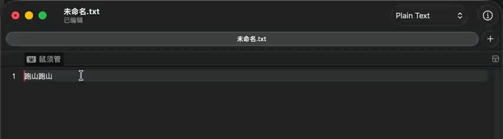

# pantsu-xkjd6alter（胖次键道-星空键道6•改），又名磨道，折磨版键道

## 简单的介绍

GitHub仓库链接：https://github.com/flappybriefs/pantsu-xkjd6alter

胖次版键道，修改了大量的词序，修改了大量的630词汇，并加以扩充，将次选的一简二简单字加了无理码，增加了很多词组二简和声声笔，后移了一部分单字，所以使用习惯和键道官方版以及一些别的衍生版差别很大，故又名折磨版键道，既磨道，为了极致的码长和顶功的快感而魔改。

一些小功能：

- 无候选时单击[开启自造词，**自造词时建议逐字打，打词也可，原则上可以但最好不要用630** ，最后按空格确认上屏后自造词完成，自造词保存在pantsu.user.dict最后，无需重新部署即可以直接使用；
- 考虑到不需要太多候选，所以指定数字1-7为选字/词上屏，**8为将当前候选提前，9为将当前候选后移，0为将当前候选删除**，无需重新部署即可以直接使用；

以上两个功能的演示：

- 调频撤销Mac、win以及linux均用Control+z；查看修改历史Mac端为Ctrl+H，win以及linux用Ctrl+Shift+H，不行的话用Ctrl+H；手机端使用给的仓输入法的配置自己调整。
- 打字时使用单引号'开关emoji；
- 按]开启临时英语；
- /开头是诗词和东方project相关词汇，可以在pantsu.user.dict里面找到并修改/删除；
- 单引号'开头开启二分，使用键道的双拼打二分对生僻字进行查找，反查的基本上所有的常用字和多数生僻字都有拼音标注在后面;
- `开启反查，与官方版一致，也带有拼音的标注在后面;
- 移植了一部分小鹤的符号，;f开启；
- 该方案无次选按钮，如果想开的话需要自己设置一下，不能用;’/作为次选或三选，其余皆可。

如果用的是iOS，可以用我制作的仓输入法皮肤，即hamster.yaml，里面有两种适用于胖次键道的布局，也可用在吉旦饼方案中。

友链：[天行键](https://github.com/wzxmer/rime-txjx)，[星猫键道](https://github.com/hugh7007/xmjd6-rere)

### 自造词及调频功能详述
- 自造词前需知：  所有造出来的辞会形成一个单独的文件，这个文件为： pantsu.zzc.dict.yaml
- 空输入时按 `[`：按常规最短空码规则造词。
- 已有输入码时按 `[`：锁定当前输入码造词，当前编码已有词时，原词自动后移；新词原本存在但在后续码时自动提前。
- 选入字词后立即显示最终编码、被后移词和飞键数量；按一次空格上屏并保存。
- 8、9、0三个按键现用作调频，8为前移，9为后移，0双击为删除。将当前码提前或者后移、删除的时候当前码会空余出来，自行选择哪个码按8提前来替换当前空码，之前自动以字母顺序顺延的逻辑感觉不太对。
- 自造词自动额外造飞键的词：声母首位`q/f`、`w/j`，以及 `uang` 韵母第二位 `x/m`。
- 调频前移的时候会显示再上一级编码及其当前占用词，方便判断是否继续前移。
- ;; 显示最近 5 个上屏记录，最近一次上屏记录在首选。

---

## 一些大的更改

### 重大更新

2026-06-19 使用vibe coding增加了**自造词**和**调频**及**删词**功能，ChatGPT救我命！
对于调频稍作解释一下，打个比方：
1. “候选词”现在是hxciu，这三个字使用频率比上一位码hxci的“虎耳草”高得多，所以我调频可以这样：输入hxciu后不上屏，对着“候选词”这个词点一下8，“候选词”的码就变成了hxci，这个时候“虎耳草”的码自动变成hxciv，原本hxciv的“华西村”继续后移，变成hxcivv；
2. “孩儿参”这个词使用频率极低，不如“好像从”，这个时候我可以输入hxca之后后移或者删除“孩儿参”，后移时点9，“孩儿参”的码变成hxcau，原本这个码的“海鲜餐”变成hxcaui；删除时点0，hxca变成空码，这个时候次选是“好像从”，则“好像从”的码自动上位，hxcai这个时候是空的，如果后面有候选则继续这个操作。
如果你有更好的操作逻辑可以提出。

---

2023-12-21 更改了pantsu.user.dict，将所有符号都改成了;开头，而东方和诗词词汇用/开头，这样就不会影响到i和o上面的字的顶功了，并更新了一下最新的beta测试版的仓的布局文件，逗号和句号下划是以词定字的选第一个和选最后一个。

---

2023.12.16 增加了键道码表版的二分，打生僻字更简单了，使用’开启，二分的键道版码表由[星猫键道](https://github.com/hugh7007/xmjd6-rere)提供，二分方案和码表名称目前前缀为pantsuef

---

2023.11.19 在浮生大佬的帮助下将我的文件进行了大量删减并带上了前缀，并且不再需要rime.lua，这样就非常好整理了

---

2023.11.17正式更名为胖次键道，不跟官方版的冲突

---

做了个iOS的仓输入法的皮肤，需要的话自取，自带横屏模式

---

2023.11.2 终于还是受不了过于抽象的外挂词库2了，于是将其删去了，重制了一版外挂码表，目前看来还算不错。

---

2023.10.22稍微精简了一下文件，将外挂词库里面的网络词库更新到了2023.10.20版，并修改扩大了临时英文的词库。增加了我自己做的仓输入法的皮肤。

---

2023.6.29加了一个乐子外挂waigua2，百万级别的词库，有很多废词，可选择关闭或者删除

---

2023.6.24精简掉了词库，只保留altercizu和waigua

---

2023.6.3更新了两版的词库，xkjd6.altercizu1和xkjd6.waigua1、xkjd6.altercizu2和xkjd6.waigua2，其中altercizu可以替换官方词库，altercizu2更大一些，废词也更多一些，但用起来空码的情况少很多，根据需要选取1或者2，外挂词库跟着数字选取，在extended.dict里面开关。

---

2023.5.31更新了一个我重新制作的词库xkjd6.altercizu，里面包含官方词库，以后就默认启用和修改这个了，有空了我会基于这个新词库重新制作一下外挂词库

---

星空键道6的胖次个人魔改版，仅修改了普通版本，并击和单字版并未魔改，并且在官方版的基础上添加了反查的拼音（如下所示），并添加了对于emoji的支持。

增/删/改了很多原版词库里面的词以及词序，并且仍在进行中。单字的二简二三选全部改成了无理码，不必使用数字选重，无理码规则参照了西风瘦码，;表示左右结构，/为非左右结构。目前正在陆续增加单字的无理码以尽量降低单字的码长，增强输入体验。

本人是在Mac的鼠须管和iOS端的iRime使用，目前没有问题。

其中[xkdj6.waigua.dict.yaml](https://github.com/flappybriefs/xkjd6-alter/blob/main/xkjd6.waigua.dict.yaml)是我自己整合的多个词库做出的超大词库，可以在[xkjd6.extended.dict.yaml](https://github.com/flappybriefs/xkjd6-alter/blob/main/xkjd6.extended.dict.yaml)里面注释一下关掉/删除。

emoji来自于：[rime-opencc_emoji_symbols](https://github.com/rtransformation/rime-opencc_emoji_symbols)，为了防止emoji影响单字上屏，默认是关闭的，可使用单引号'开关emoji。

添加了[星猫键道](https://github.com/wzxmer/xkjd6-rime/tree/main) 的英文输入（v开启）和GKB单字码表（o开启），但考虑到反查寻找可能有点难受，所以未加入到反查里面。
